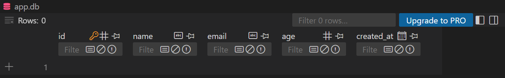

# Flask-Migrate 資料遷移技術筆記 2025/2/23

## 📚 資料遷移 (Database Migration) 是什麼？
資料遷移 (Migration) 是在應用程式開發過程中，對資料庫結構 (Schema) 進行變更的一種技術。
常見的資料庫結構變更包括：
- **新增欄位** (Add Column)
- **修改欄位類型** (Alter Column)
- **刪除欄位** (Drop Column)
- **新增資料表** (Create Table)
- **刪除資料表** (Drop Table)

---

## 🚦 Flask-Migrate 是什麼？
**Flask-Migrate** 是基於 **Alembic** 的一個 Flask 擴展，配合 **Flask-SQLAlchemy** 使用，提供資料庫遷移功能。
它能讓你在不刪除資料庫的情況下，自動化、可控地更新資料庫結構。

---

## 🛠️ Flask-Migrate 安裝與設定

### 1. 📦 安裝套件
```bash
pip install Flask Flask-Migrate Flask-SQLAlchemy
```

### 2. 📝 設定 Flask 應用程式 (app.py)
```python
from flask import Flask
from flask_sqlalchemy import SQLAlchemy
from flask_migrate import Migrate
from extensions import db
from models import User # 導入模型
from flask import jsonify

app = Flask(__name__)

# 設定資料庫 (使用 SQLite 進行示範)
app.config['SQLALCHEMY_DATABASE_URI'] = 'sqlite:///app.db'
app.config['SQLALCHEMY_TRACK_MODIFICATIONS'] = False

# 資料庫 & 遷移工具初始化
db.init_app(app)
migrate = Migrate(app, db)


@app.route('/')
def home():
    return 'Hello, Flask-Migrate!!'
    
if __name__ == '__main__':
    app.run(debug=True)


```

---

## 🧬 資料庫遷移的操作流程

### 1. 初始化資料庫遷移環境
```bash
flask db init
```
- 這會創建 **migrations** 資料夾，包含資料庫遷移的基礎結構。

### 2. 修改資料庫模型 (models.py)
```python
from extensions import db  # 改成從 extensions 匯入 db
from datetime import datetime

# 建立一個簡單的 User 資料庫模型
class User(db.Model):
    id = db.Column(db.Integer, primary_key=True)
    name = db.Column(db.String(50))
    email = db.Column(db.String(120), unique=True)
    age = db.Column(db.Integer)  
    created_at = db.Column(db.DateTime, default=datetime.utcnow)  # 新增的欄位
    
    def __repr__(self):
        return f'<User {self.name}>'

```
- 我在這邊創建一個created_at欄位，用來紀錄使用者資料的創建時間。


### 3. 生成遷移腳本 (Migration Script)
```bash
flask db migrate -m "add created_at column to user"
```
- 這會在 **migrations/versions** 資料夾中生成 `.py` 文件，記錄資料庫變更指令。

### 4. 應用資料庫變更
```bash
flask db upgrade
```
- 會根據 **upgrade()** 方法執行資料庫變更，將模型的更新應用到資料庫。

### 5. 成果展示



### 6. (選擇性) 回滾資料庫變更
```bash
flask db downgrade
```
- 會執行 **downgrade()** 方法，將資料庫結構還原到上一個版本。

---

## 🛠️ 常用指令彙整

| 指令 | 功能 |
|------|------|
| `flask db init` | 初始化資料庫遷移環境 |
| `flask db migrate -m "message"` | 生成遷移腳本 (提交訊息) |
| `flask db upgrade` | 應用資料庫變更 |
| `flask db downgrade` | 回滾資料庫變更 |
| `flask db history` | 查看遷移歷史 |
| `flask db current` | 查看當前資料庫版本 |

---


